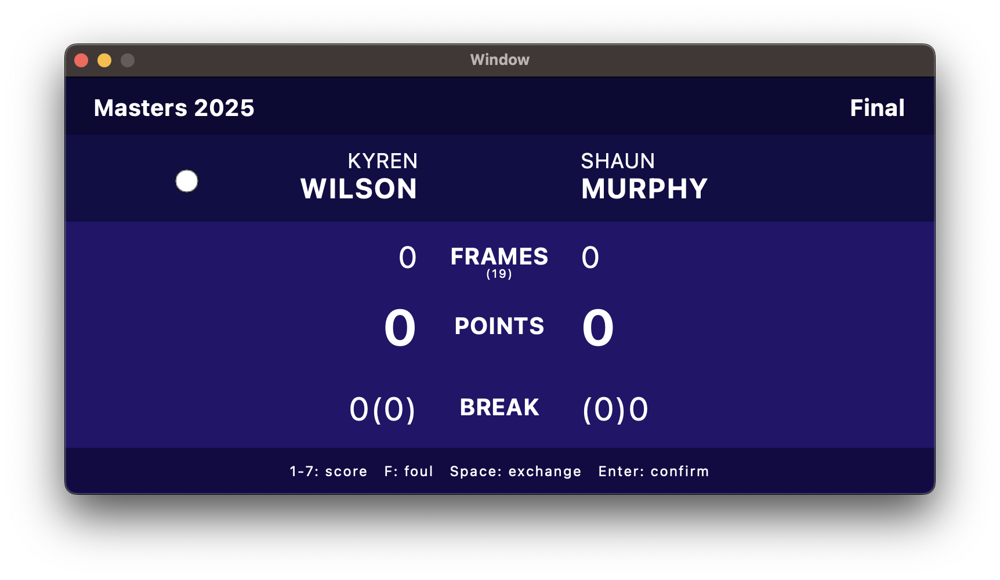

# snooker-scoreboard

简易斯诺克计分牌。

## Dependencies / 环境依赖

Qt6, CMake(>= 3.29)

## GUI / 用户界面

- 上方为标题栏：包含赛事名称和目前的赛程；

- 标题栏下方为选手名字和目前正在操作的球员指示灯；

- 中间为分数板：包含两个选手获胜局数、当前局的分数和当前的单杆得分（括号中为当前局单杆最高分）；

- 最下方为操作指南。

## Usage / 使用方法

键盘操作：

- `1`~`7`：分别输入 1~7 分
- `F`：犯规，指示灯变红色，接着输入分数，给对方加分
- `Space`：切换当前操作的选手
- `Enter`：结束当前局，切换到下一局

用户可以自定义 Data/demo.json 中的比赛信息，程序运行的时候会从此文件中加载已有的局数信息，在 confirm 的时候也会把当前的局数信息写回到此文件中。